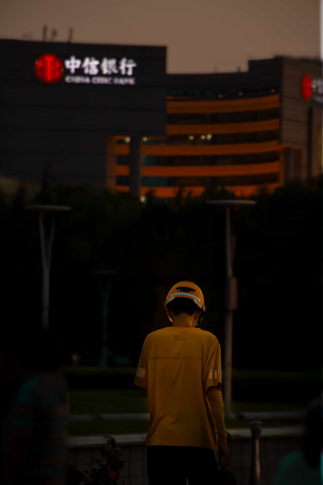
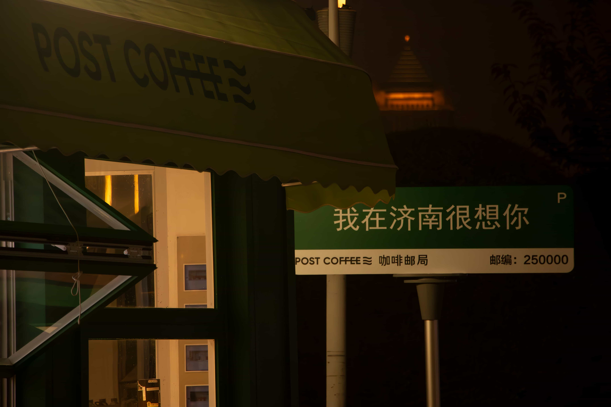

# Photos

---
## Why?
> 非常神奇，我竟然爱上了拍照？
> 
> 等一下，这是为什么呢？:cold_sweat:
> 
> 一个男生喜欢拍拍拍？:cold_sweat:  :astonished:  :cold_sweat:

## Reflog
> 小心愿：用一次哈苏X2D :two_hearts:

- 2022.01 ~ 2023.02   [Canon 500d](https://m.canon.com.cn/product/500d/)
- 2023.06 ~ Today [Honor 90](https://www.honor.com/cn/phones/honor-90/) 
- 2023.07 ~ 2023.08  [Canon 70d](https://m.canon.com.cn/product/70d/)
- 2023.11.12 [Lumix GH6](https://consumer.panasonic.cn/product/cameras-camcorders/lumix-series/lumix-g-series/dc-gh6.html)
- 2024.01.27 ~ 2024.6.30 [Canon 6d2](https://www.canon.com.cn/product/6dmk2/) + [EF 70-200mm f2.8 L SUM](https://www.canon.com.cn/product/ef70200f28l/)
- 2024.05.23 [SONY a7c](https://www.sonystyle.com.cn/products/ilc/ilce_7c/ilce_7c_feature.html) 
- 2024.07.01 ~ Today [Nikon Z6II](https://www.nikon.com.cn/sc_CN/product/mirrorless/z-6ii)
- 2024.08.02 [SONY a7r5](https://www.sonystyle.com.cn/products/ilc/ilce_7rm5/ilce_7rm5_feature.html)
- 2024.08 [fujifilm GFX 100 II](https://fujifilm-x.com/zh-cn/products/cameras/gfx100-ii/)

## Cards
#### 济南印象
> Description:
>
> 济南是我的家乡，是我爱的城市，所以理所当然应该单独出一期专辑。
>
> 这里是`泉城`，即使作为一个并不爱旅游的本地人，这里的景点我却`百去不厌`
> 
> 这里有着别的地方无可比拟的温度和人情味。
> 
> 这里有我爱的人和爱我的人，这里也有非常多美好的事物值得我记录。

---

> 泉城广场天空的风筝，好像一年四季，只要天气好，泉城广场都会有很多风筝，晚上也会有很多亮灯的风筝。~~都快成泉城广场特色了~~

 

 

 
> 大观园，济南曾经非常热闹的地方，现在也只是门外的马路比较热闹，其内部很多店都空了，承载着一个时代的记忆

 

 

> 解放阁，现在好像成了晚上年轻人打卡的网红热点，但好像很少有人白天进去了解属于济南的红色文化。上一次进去好像还是初中...大多数都是路过在外面看看。

 

> 大明湖：来看看不同时期用不同相机拍的荷花~

 

 

 

 
 
 
 
 
 

> 泉城广场、绿地（中间那个是风筝，不是海鸥，竟然有外地朋友看到中间那个问是不是海鸥，好神奇哈哈，济南不临海！！）

 

 

 

 

> 在之前的家（三箭吉祥苑）楼顶拍的绿地

 

> 泉城广场的人文景象：

 
 
 
 
 

 
 
 
 
 
 
 
 
 
 
> 山东省人大：

 

> 黑虎泉，好久都没去过了，之前还要门票，现在都免费哩。

 

> 山东剧院，初中被拽过去看过一次音乐表演

 

> 济南老城改造，之前只有黑白影像记录...

 

 

> 济南工业区

 

> 二环东高架的车流，也是在吉祥苑屋顶拍的

 

> 龙年限定：恒隆广场新年总能给人惊喜，那个寒假有很美好的回忆。当时怀念过去，憧憬未来。

 
 
> 当时超级冷，在醉得意吃完饭，五个男的冻得发抖

 

> OMG,济南有我们自己的`古今同框`
 
 

> 大明湖的夕阳也很好看，一组姐妹在晒太阳，一个还是小学老师哈哈，还用拍立得帮他们拍了一张
 

> 大明湖外地穿汉服的游客总是超级多，乐于助人帮陌生人拍的照

 

> 车流车流~

## TimeLine
- 2023年1月，手持[Canon 500d](https://m.canon.com.cn/product/500d/)，拍下了在老家过新年的场景，算是第一次正式拿起家中尘封已久的相机。
> 这个东西叫什么来着...仙女棒吗?

> 这是我姥姥:kissing_heart:

